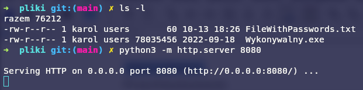
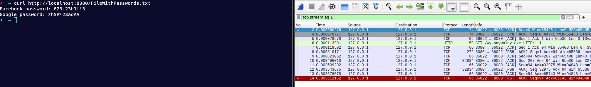

	<table>
		<tr>
			<td>Imię nazwisko</td>
			<td>Karol Gębski</td>
			<td>Numer Indeksu</td>
			<td>279408</td>
		</tr>
		<tr>
			<td>Labolatorium nr</td>
			<td>1</td>
			<td>Data</td>
			<td>13.10.2024</td>
		</tr>
	</table>

## Przygotowanie

Pracę nad zadanie zaczołem od pobrania dwóch plików z sieci (`txt` i `exe`) i przeniesieniu ich do specjalnego folderu na którym wykonałem komendę.

	

Dzięki temu mogłem w bezpieczny sposób pobrać pliki lokalnie z komputera. Eliminują przy okazji zbędny szum sieci.

## Whreshark

Zaczołem nasłuchiwać na mojej karcie sieciowej za pomocą programu `Whireshark` i pobrałem kolejno dwa pliki zapisując każdy z nasuchów i wyekstraktowanej komunikacji.

	

