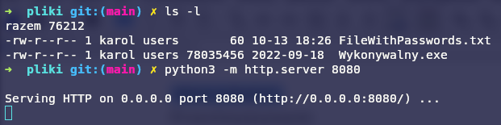
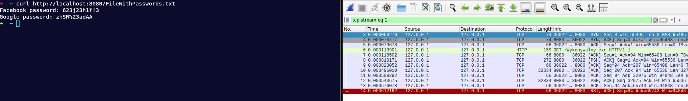
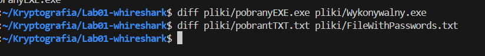
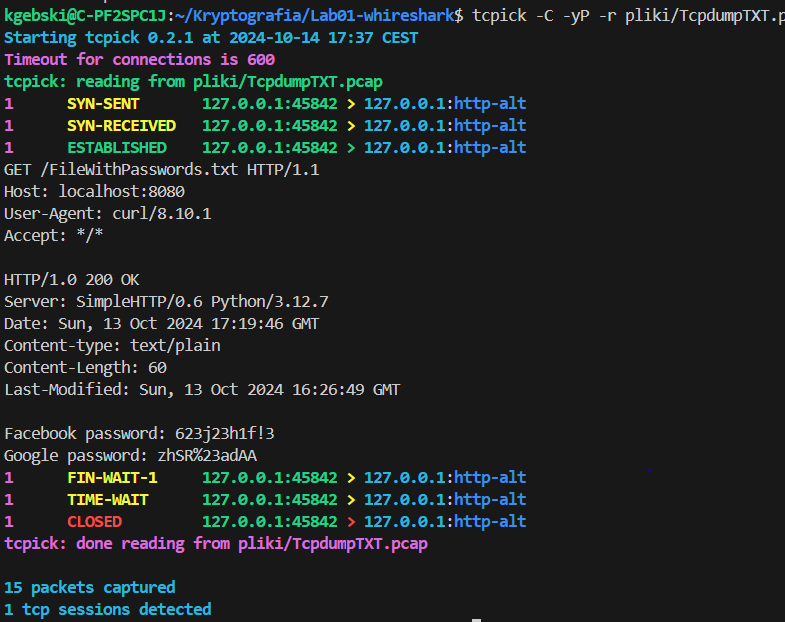
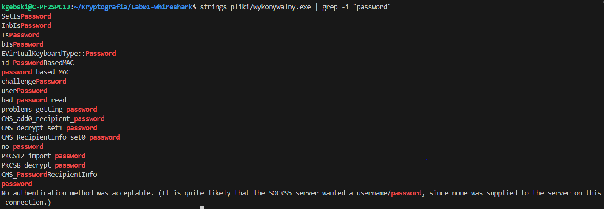
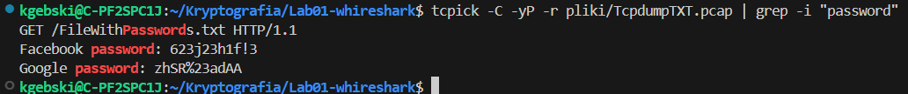

	<table>
		<tr>
			<td>Imię nazwisko</td>
			<td>Karol Gębski</td>
			<td>Numer Indeksu</td>
			<td>279408</td>
		</tr>
		<tr>
			<td>Labolatorium nr</td>
			<td>1</td>
			<td>Data</td>
			<td>13.10.2024</td>
		</tr>
	</table>

## Przygotowanie

Pracę nad zadaniem zacząłem od pobrania dwóch plików z sieci (`txt` i `exe`) i przeniesienia ich do specjalnego folderu, w którym wykonałem komendę.

	

Dzięki temu mogłem w bezpieczny sposób pobrać pliki lokalnie na komputer. Eliminuję przy okazji zbędny szum sieci.

## Whreshark

Zacząłem nasłuchiwać na mojej karcie sieciowej za pomocą programu `Wireshark` i pobrałem kolejno dwa pliki, zapisując każdy z nasłuchów i wyekstrahowanej komunikacji.

	

Po wyekstraktowaniu ze strumienia zapisu ruchu sieciowego porównałem je za pomocą komendy `diff`.

	

Pokazany wyżej zrzut ekranu wskazuje, że między pobranym a oryginalnym plikiem nie ma żadnej różnicy. Jedyną różnicą w plikach przed przerobieniem były nagłówki protokołu HTTP.
## Tcpdump

Tak samo jak u poprzednika udało się przechwycić ruch na karcie. Oprócz nagłówków HTTP nie było widać żadnych różnic między plikami.

	

## Przegląd plików pod względem haseł

	
	

## Podsumowanie
### Porównanie Tcpdump i whireshark
#### tcpdump:

###### Zalety:
Lekki, działa w terminalu, idealny do szybkiej analizy sieci w czasie rzeczywistym, niski narzut zasobów, dobrze współpracuje z innymi narzędziami skryptowymi.
##### Wady:
Brak interfejsu graficznego, trudniejszy w użyciu dla początkujących, mniej intuicyjny w analizie dużych plików.
#### Wireshark:

###### Zalety:
Przyjazny interfejs graficzny, zaawansowane opcje filtrowania, szczegółowa analiza protokołów, łatwy w użyciu dla początkujących i profesjonalistów, lepszy w analizie historycznych danych.
###### Wady:
Zajmuje więcej zasobów systemowych, wolniejszy od tcpdump, mniej wydajny w analizie dużych strumieni danych w czasie rzeczywistym.
